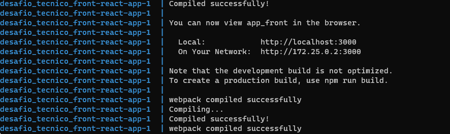
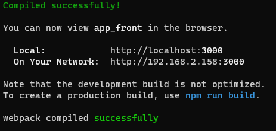
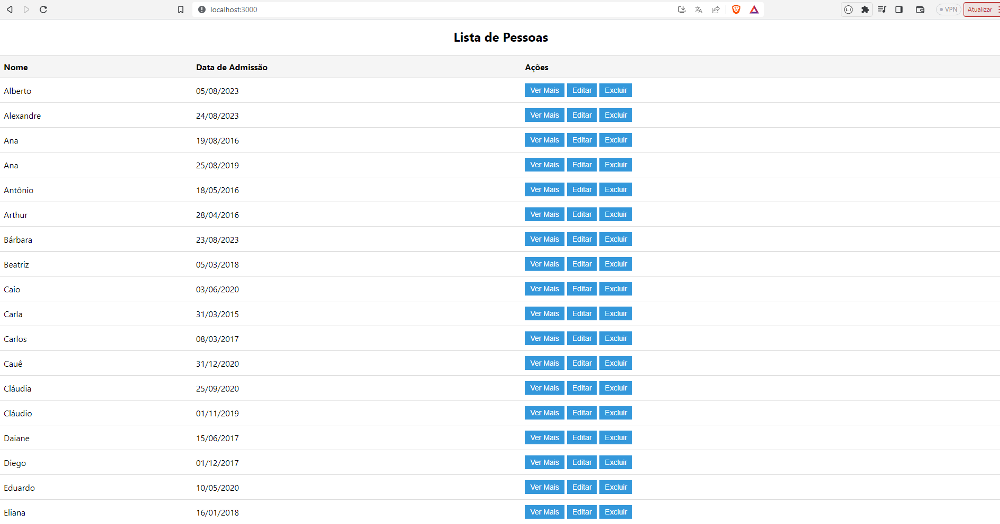

# Desafio Técnico Frontend
Repositório contendo o Frontend do desafio técnico. Abaixo cestão as instruções para rodar o projeto.

## Instalação

1. Clonar o repositório

```
    git clone https://github.com/Pedro-V8/desafio_tecnico_front.git 
```

2. Entrar no diretório

```
   cd desafio_tecnico_front/
```

3.  Rodar o projeto com docker-compose

```
   docker-compose up --build
```
OBS: É essencial que o servidor já esteja rodando. Documentação do Backend se encontra em: https://github.com/Pedro-V8/desafio_tecnico_api

- Após o build e o container estiver rodando deverá aparecer o log abaixo:



4. Outra alternativa sem usar o docker seria utiliando o npm

```
   npm install

   npm start
```

- Saída esperada:



Acessar a url: http://localhost:3000/

Tela inicial:




